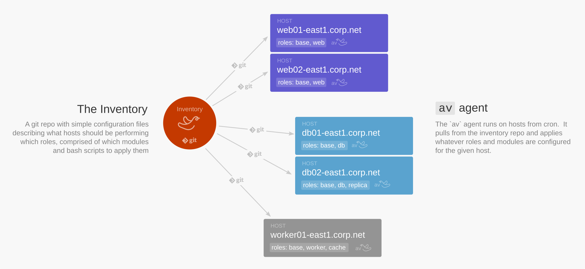

***

Minimal distributed configuration management in Bash. A tiny, lightweight alternative to Ansible, Chef, Puppet, and other heavy orchestration tools. Made with :heart: by the folks at https://frameableinc.com.

```bash
$ sudo av apply
Fetching inventory...
Applying module nginx
Applying module memcached
Done
```

## How It Works



Aviary.sh follows three simple guiding principles:
* **Bash is just fine** (it has been standard on servers for decades).
* **Minimize abstraction layers** to keep configuration readable and simple.
* **Each host is self-sufficient** (pull-based, no central orchestration pushes).

Each node periodically pulls the latest version of the configuration repository (the **Inventory**) to discover its designated roles. Based on these roles, the node executes idempotent scripts to set up, test, or remove service modules.

---

## Getting Started

### 1. Installation

Install Aviary.sh directly from the command line on a machine to be managed:

```bash
curl https://aviary.sh/install | sudo bash
```

> [!NOTE]
> Depending on the installer version used, this sets up the periodic cron schedule either in the system-wide `/etc/crontab` file or in a dedicated `/etc/cron.d/aviary` configuration file (strongly recommended).

### 2. Inventory Setup

Initialize your configuration repository (the inventory):

```bash
mkdir inventory
cd inventory
mkdir {hosts,modules,roles,directives}
touch {hosts,modules,roles,directives}/.gitkeep
git init
git add .
git commit -m "initial commit"
```

Configure and push your repository to a Git remote:

```bash
git remote add origin $my_origin_url
git push -u origin master
```

Configure Aviary.sh to point to this repository in [config](file:///home/clement/Documents/PRIVATE/aviary.sh/config):

```bash
echo "inventory_git_url=$my_origin_url" >> /var/lib/aviary/config
```

> [!IMPORTANT]
> Since Git operations run non-interactively, ensure that SSH deploy keys or Personal Access Tokens are configured. You can include credentials in the URL: `https://<username>:<access_token>@github.com/org/aviary-inventory.git`.

### 3. Adding Modules

Create a directory for your first module (e.g., Message of the Day `motd`):

```bash
mkdir -p modules/motd
```

Write an idempotent script `modules/motd/apply` to enforce the configuration state:

```bash
# inventory/modules/motd/apply
cat <<EOF > /etc/motd
"Ever make mistakes in life? Let’s make them birds. Yeah, they’re birds now."
--Bob Ross
EOF
```

Assign this module directly to your host:

```bash
mkdir -p hosts/$(hostname)
echo motd > hosts/$(hostname)/modules
```

Commit these files to your Git repository and push them to origin.

### 4. Running `av`

Apply the configuration state manually:

```bash
# av apply
Fetching inventory...
Applying motd...
Done.
```

To see the host's current role and module configuration status:

```bash
# av status
STATUS OK
```

---

## Core Concepts

* **Inventory**: Git repository containing all configurations, roles, hosts, modules, and one-off directives.
* **Host**: A managed machine identified by its hostname.
* **Role**: A high-level description of a host's function (e.g., `web`, `database`), mapping to a list of modules.
* **Module**: A package, service, or script ensuring specific system configurations. Can define `apply` (install), `test` (assert), and `drop` (uninstall) actions.
* **Directive**: One-time shell script executed immediately when discovered (within a 24-hour window).

---

## Variables Resolution & Sourcing Order

Aviary.sh resolves environment variables in a cascading, hierarchical order, allowing narrow scopes (like a host or module) to override broader ones (like global or role defaults).

The resolution order is as follows:

| Order | Scope | Path |
| :--- | :--- | :--- |
| **1** | Global | `$inventory_dir/variables` |
| **2** | Role | `$inventory_dir/roles/<role>/variables` |
| **3** | Host | `$inventory_dir/hosts/<host>/variables` |
| **4** | Module | `$inventory_dir/modules/<module>/variables` |

> [!TIP]
> Variables can contain dynamic Bash assignments and shell expansion. They are automatically evaluated and exported when applying modules.

### Example: Sprucing Up `motd` with Templates

Add a template `modules/motd/motd.template`:
```
Welcome to {{ hostname }}

"Ever make mistakes in life? Let’s make them birds. Yeah, they’re birds now."
--Bob Ross
```

Define a variable in `modules/motd/variables`:
```bash
hostname=$(hostname)
```

Update `modules/motd/apply` to process the template:
```bash
# Source template engine and variables
source template
source variables

template $(dirname $0)/motd.template > /etc/motd
```

---

## Command Line Interface (`av`)

### General Options
* `--help`: Show the help message.
* `--version`: Show CLI tool version.
* `--log-level <level>`: Set output verbosity (`trace`, `debug`, `info`, `warn`, `critical`).
* `--inventory <path>`: Run against a local inventory folder instead of pulling from Git.
* `--no-fetch`: Run commands directly without fetching/updating the inventory first.
* `--force`: Run even if a pause or run lock file is present.
* `--quiet` / `-q`: Suppress log messages.

### Commands

| Command | Description |
| :--- | :--- |
| `status` | Report the last run status (`OK`, `FAIL`, etc.) and system info (default). |
| `apply` | Fetch inventory, evaluate changes, apply modules, and drop obsolete modules. |
| `check` | Validate syntax and sanity of hosts, roles, and modules in the inventory. |
| `fetch` | Pull the latest changes from the upstream Git inventory. |
| `directive` | Scan and run outstanding one-off directives modified in the last 24 hours. |
| `pause` | Prevent periodic cron-triggered `av apply` runs (creates a `.pause` lock file). |
| `resume` | Allow periodic runs again (removes the `.pause` lock file). |
| `recover` | Manually clear the run lock file (`.lock`) after an execution failure. |
| `list-hosts [filter]` | List inventory hosts, optionally filtered by roles or variables (e.g., `role=web`). |
| `list-modules` | List all available modules defined in the inventory. |
| `list-roles` | List all available roles defined in the inventory. |

### Host Manipulation Commands
Manage roles and modules directly in the inventory:
* `av host <host>`: Show attributes, roles, modules, and variables for the host.
* `av host <host> add`: Register a new host in the inventory.
* `av host <host> remove`: Remove a host from the inventory.
* `av host <host> add-module <module>`: Assign a module directly to the host.
* `av host <host> remove-module <module>`: Unassign a module from the host.
* `av host <host> add-role <role>`: Assign a role to the host.
* `av host <host> remove-role <role>`: Unassign a role from the host.

---

## Automated Execution (Cron)

To keep configurations continuously synchronized, two automated cron jobs are set up:

1. **Directives Engine** (`* * * * *`): Runs every minute to quickly pick up and run one-off tasks.
2. **Apply Engine** (`X * * * *`): Runs once every hour at a randomized minute `X` (determined at installation to prevent all nodes from hammering the Git remote repository at the same time).

For isolation and safety, it is highly recommended to configure these jobs inside `/etc/cron.d/aviary` rather than the system-wide `/etc/crontab`.
